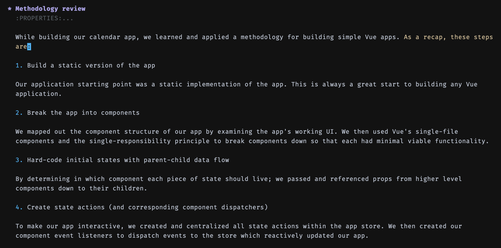

# hl-sentence

Highlight sentences in Emacs with a custom face.  Very nice.

I make filter funtion to get target element highlight.

``` emacs-lisp
(defun plainp ()
  "Check current sentence is paragraph and it's parent is section."
  (and
   (eq (org-element-type (org-element-at-point)) 'paragraph)
   (or
    (eq (org-element-type (org-element-property :parent (org-element-at-point))) 'section)
    (eq (org-element-type (org-element-property :parent (org-element-at-point))) 'item)
    )
   ))
```



# Customizing the Face

Highlighting is based on the `hl-sentence` face which you can
customize to make the face look the way you want.  I use this
primarily in LaTeX mode where I enable `variable-pitch-mode`.  So I
customize my `variable-pitch` face foreground to be `gray60` and then
make `hl-sentence` be `black`.  Works nicely.

# Credit

This was taken mostly from
<http://www.emacswiki.org/emacs/SentenceHighlight>

I believe Aaron Hawley is responsible.  I just took it and made it a
single file and to properly enable and disable the minor-mode.

